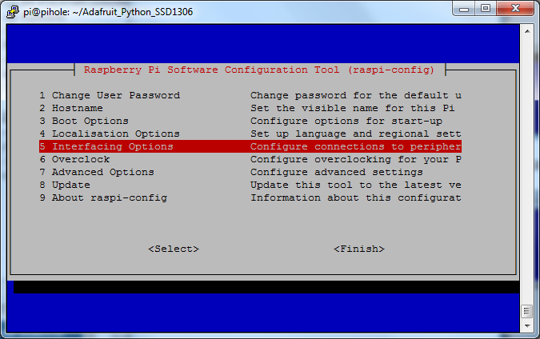
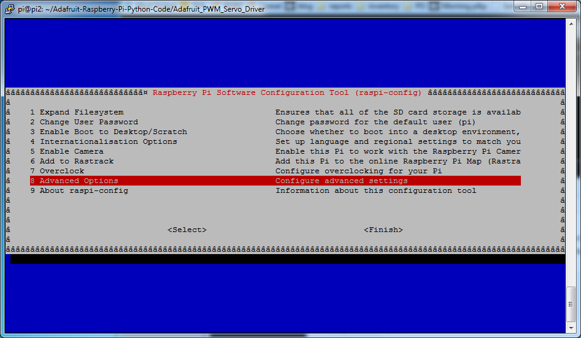
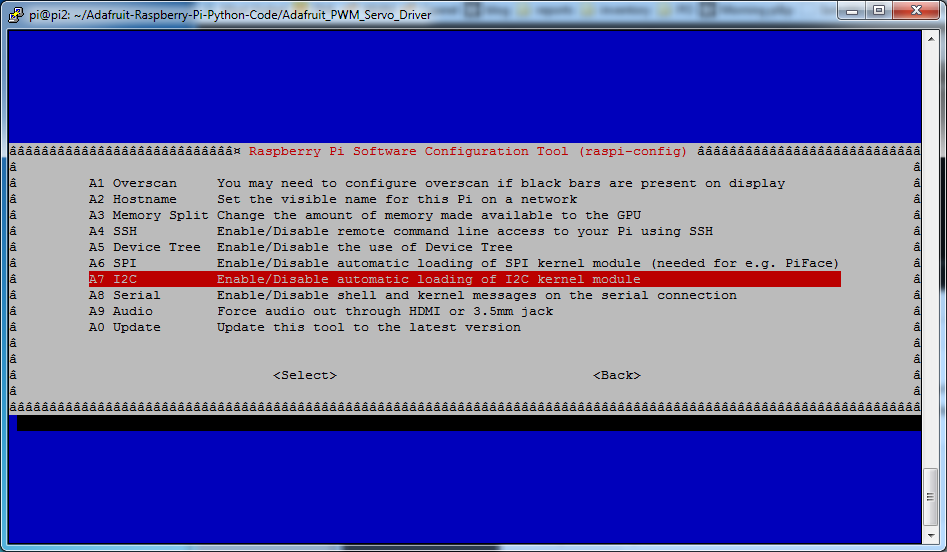
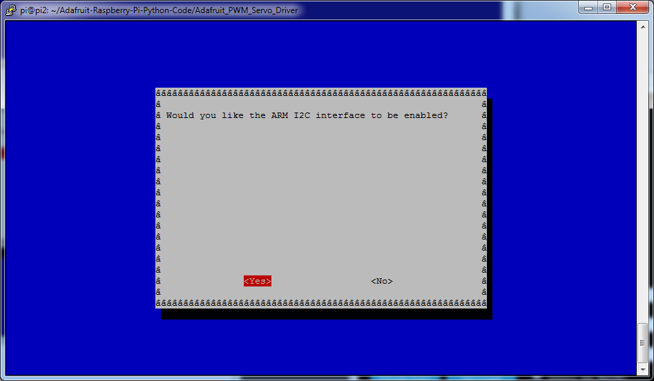
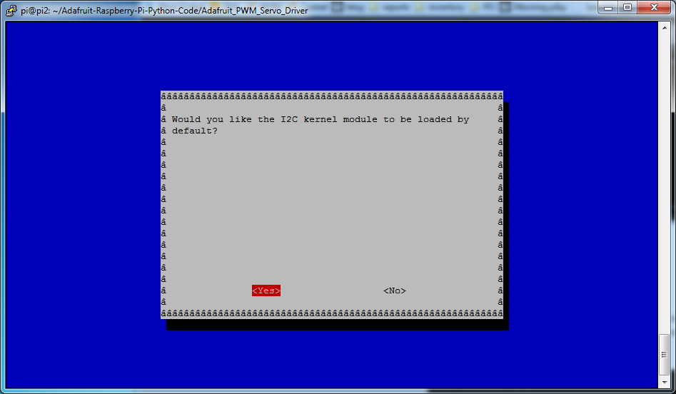
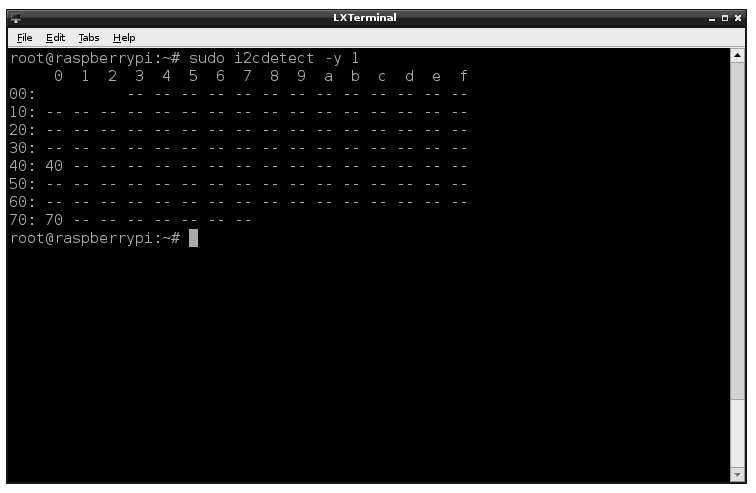

# HTPA32x32d Capture Image

## Projenin amacı
Raspberry pi ile beraber HTPA32x32d 'den görüntü almak.
## Gereksinimler
### Raspberry pi Konfigurasyonu
    			
İlk olarak I2C ayarlarını yapıyoruz.
#### [I2C'yi Yapılandırma](https://learn.adafruit.com/adafruits-raspberry-pi-lesson-4-gpio-setup/configuring-i2c)

Konsolu açtıktan sonra `Sudo raspi-config` yazalım.

Ardından aşağıdaki adımları takip edelim.
    			
                
                
                
                
Cihazın bağlantılı olup olmadığını görmek için `sudo apt-get install -y i2c-tools` kütüphanesini indirin ve konsola    `sudo i2cdetect -y 1` yazın eğer birinci kanalı kullanmıyorsanız 0-2-3 gibi kanallarada bakabilirsiniz.                    
              
 Daha sonra I2c hızınızı ayarlamanız gerekir. HTPA teknik mühendisleri ile bir diyaloğumuzda 1Mhz ayarlamamızız sağlıklı olacağı söylenmişti ona istinaden bu ayarları yapıyoruz.
 
 `sudo nano /boot/config.txt`
 "dtparam=i2c_arm=on,i2c_arm_baudrate=1000000" satırı ekledikten sonra dosyayı kaydedip çıkın.
 `sudo reboot` cihazı yeniden başlatabilirsiniz.

                
## Kod İçeriği
## Çıktılar
## Yaşanılan Problemler
## Ekstra Bilgiler
