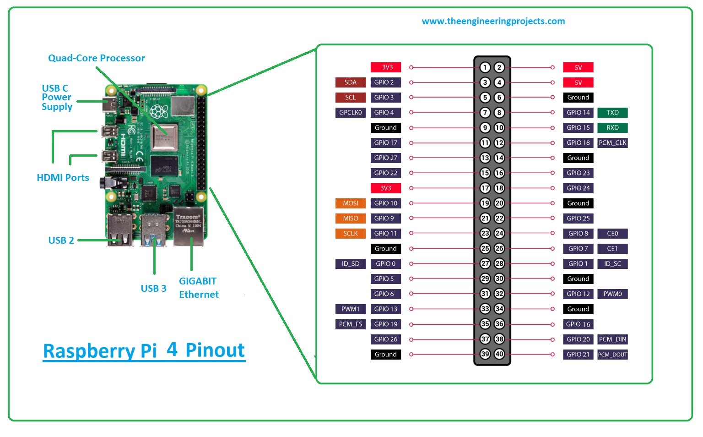

# HTPA32x32d Capture Image

## Projenin amacı
Raspberry pi ile beraber HTPA32x32d 'den görüntü almak.

## Gereksinimler

### Raspberry pi Konfigurasyonu

Raspberry-pi 4 Pin Tablosu

İlk olarak I2C ayarlarını yapıyoruz.

#### [I2C'yi Yapılandırma](https://learn.adafruit.com/adafruits-raspberry-pi-lesson-4-gpio-setup/configuring-i2c)

Konsolu açtıktan sonra `Sudo raspi-config` yazalım.

Ardından aşağıdaki adımları takip edelim.
    			
                
                
                
                
                
                
Cihazın bağlantılı olup olmadığını görmek için `sudo apt-get install -y i2c-tools` kütüphanesini indirin ve konsola    `sudo i2cdetect -y 1` yazın eğer birinci kanalı kullanmıyorsanız 0-2-3 gibi kanallarada bakabilirsiniz.                    
              
 Daha sonra I2c hızınızı ayarlamanız gerekir. HTPA teknik mühendisleri ile bir diyaloğumuzda 1Mhz ayarlamamızız sağlıklı olacağı söylenmişti ona istinaden bu ayarları yapıyoruz.
 
 `sudo nano /boot/config.txt`
 
 
 "dtparam=i2c_arm=on,i2c_arm_baudrate=1000000" satırı ekledikten sonra dosyayı kaydedip çıkın.
 
 
 `sudo reboot` cihazı yeniden başlatabilirsiniz.

                
## Kod İçeriği
### eeprom-test.py
### htpa-test.py
### htpa.py
### capture_display.py

### Tam çalışan Proje

--> htpa.py kütüphane olarak yazılmıştır.

Kütüphane için gerekli hazır kütüphaneler:
´pip install python-periphery
 sudo apt-get install python-opencv
 pip install opencv-python`

Not:kodumuz bazı gereksinimlerden dolayı python2'de çalışmaktadır python3'te çalıştırmaya kalktığınızda proje çalışmayacatır.

Ne kadar `i2cdetect` komutuyla cihazı raspberry pi tanısada bazen sensörler sıkıntı çıkartabiliyor. Sanırım cihazınız yanmış demek oluyor bunun için ana kodu çalıştırmadan önce eeprom ve cihazla haberleşebiliyormuyuz test etmemiz gerekir.

`python eeprom-test.py

 python htpa-test.py`

--> cihazın tam çalıştığına emin olduktan sonra yapmanız gereken tek şey `python capture_display.py` çalıştırmaktır.
## Çıktılar

## Ekstra Bilgiler
En çok yardım aldığım kaynaklardan biri [datasheet](https://www.prwa.com/sites/default/files/files-webpage/2020/3878/thermal-imaging-sensor-specs.pdf)'ken diğeri ise [görüntü alma](http://exclav.es/2016/10/26/talkin-ir/),[eeprom ayarları](http://exclav.es/2016/12/13/calibrating-heimann/)
